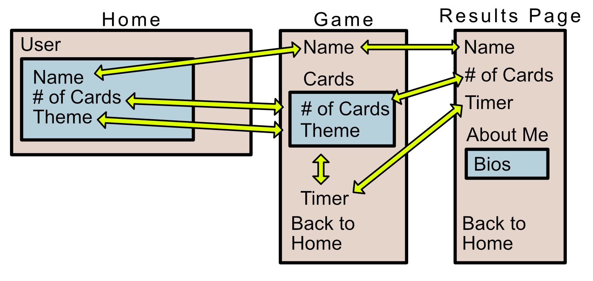

# concentration

var Contributors =  ‘Jennifer Chinzi’ && ‘Paul O’Brien’ && ‘Robert Rizo’ && ‘Colleen Sexton’

Summary:

We want to create a game of concentration.
An intro page will allow the user to customize elements of the game.
The game itself will display a set number of cards that will reveal their faces when clicked (2 per round).  If images match, those two cards will be eliminated from the game.  The game is over when all cards are matched.
The final page will display scores (time it took from initial click to finish the game).  The final page will also include an ‘About Me’ segment with brief bios of all team members

What Problem or Pain Point does it solve?

This site will solve the problem of boredom in the time of pandemics!  It will also provide a chance for users to improve their skills at this game by displaying past performance metrics.

Minimum MVP Definition

Pg 1

 - Player Name can be entered and will be saved
 - Two settings available for card art - players choice
 - Size of game can be set by player (choice of # of pairs)
 
Pg 2

 - Player name will persist on this page and be visible somewhere
 - Number of cards in game will match the setting chosen by the player
 - Card art will match the setting chosen by the player
 - Game is Playable
    - All cards begin displayed face down
    - Cards will flip to face up when clicked
    - Check for a match at every second click - if no match, cards will return to face down, else cards will be removed from the game.
    - A timer will begin with first click and will end when the last pair is matched
  - Pg 3 will be available once a game is completed
  
Pg 3

  - Display players name and final time
  - Display an ‘About Me’ segment for each team member
  
Domain Model

